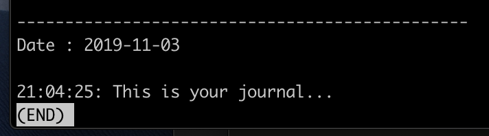

# Journal - Command Line Based Journal

## Usage

### Start your own

Fork this repository and clone repo.

### Submit an entry

Submit an entry like this:

```
./entry "This is jour journal..."
```

The entry is saved to a date-stamped markdown file, preceded with the time of entry inside the file.

The changes are then added to git staging, committed and pushed to remote.

### Read journal

To read the whole journal, starting from the latest entry, run the following:

```
./read
```

displays:


